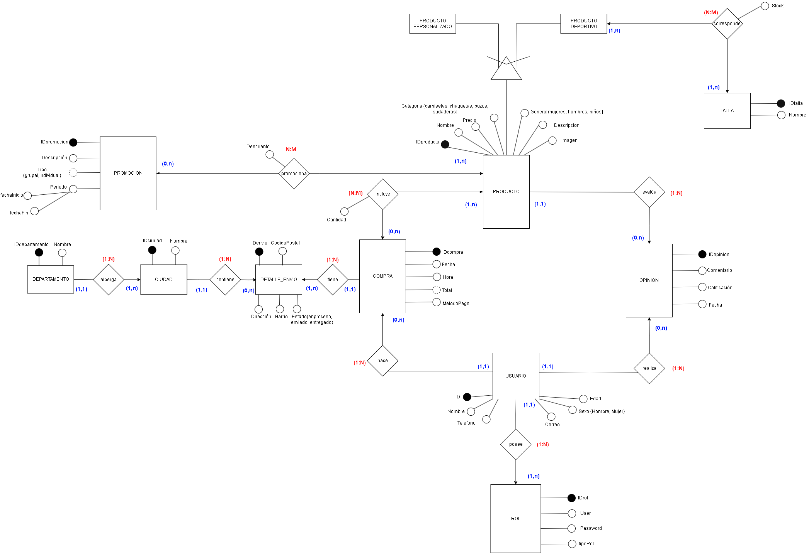
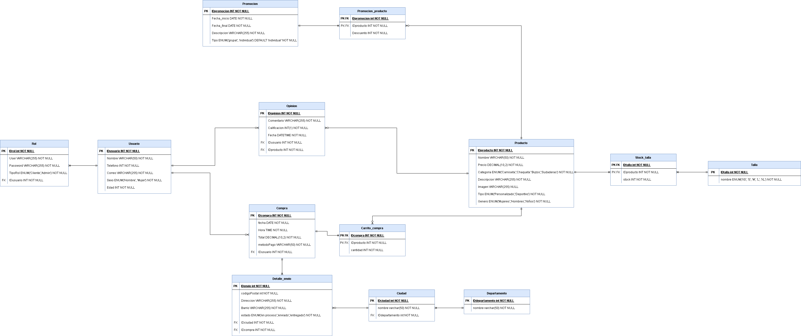

<h1 align="center">Proyecto de Almacenamiento</h1>

<p align="center">
  
</p>

# SportTrend

En el proyecto se ha diseñado e implementado un sistema de almacenamiento para respaldar una aplicación web de venta y personalización de ropa deportiva. Se han creado las tablas necesarias en la base de datos, se han ingresado valores de muestra en estas tablas y se han realizado consultas para verificar el funcionamiento del sistema.


## Plantear La Base De Datos


Para esta tarea, primero se realizó un modelo de entidad-relación para visualizar las relaciones entre las entidades. Luego, se implementó un modelo relacional basado en el modelo de entidad-relación para representar la estructura de la base de datos.
### Modelo Entidad-Relacion



### Modelo de Entidad




## Tablas y Registros

Algunas tablas y registros hechos para el proyecto a base del modelo relacional son los siguiente:

### Tabla Usuario

#### Ejemplo de Inserción de Registro

```sql
INSERT INTO PROYECTO.Usuario (Nombre, Telefono, Correo, Sexo, Edad) VALUES
('Juan Perez', 123456789, 'juan@email.com', 'Hombre', 25);
```

| IDusuario | Nombre          | Telefono   | Correo           | Sexo   | Edad |
|-----------|-----------------|------------|------------------|--------|------|
| 1         | Juan Perez      | 123456789  | juan@email.com   | Hombre | 25   |
| 2         | Maria Rodriguez | 987654321  | maria@email.com  | Mujer  | 30   |
| ...       | ...             | ...        | ...              | ...    | ...  |


### Ejemplo de Inserción de Registro En Tabla Rol
```sql
INSERT INTO PROYECTO.Rol (User, Password, TipoRol, IDusuario) VALUES
('juan_usuario', 'password123', 'Cliente', 1);

```
### Tabla Rol

| IDrol | User           | Password   | TipoRol | IDusuario |
|-------|----------------|------------|---------|-----------|
| 1     | juan_usuario   | password123| Cliente | 1         |
| 2     | admin_usuarioz | adminpass  | Admin   | 1         |
| ...   | ...            | ...        | ...     | ...       |


### Tabla Promoción

```sql
INSERT INTO PROYECTO.Promocion (Fecha_inicion, Fecha_final, Descripcion, Tipo) VALUES
('2024-03-01', '2024-03-15', 'Descuento de primavera', 'grupal');

```
| IDpromocion | Fecha_inicion | Fecha_final | Descripcion          | Tipo   |
|-------------|---------------|-------------|----------------------|--------|
| 1           | 2024-03-01    | 2024-03-15  | Descuento de primavera | grupal |
| 2           | 2024-04-01    | 2024-04-10  | Oferta individual     | individual |
| ...         | ...           | ...         | ...                  | ...    |

```sql
INSERT INTO PROYECTO.Promocion (Fecha_inicion, Fecha_final, Descripcion, Tipo) VALUES
('2024-03-01', '2024-03-15', 'Descuento de primavera', 'grupal');

```
### Producto
```sql
INSERT INTO PROYECTO.Producto (Nombre, Talla, Precio, Categoria, Descripcion, Stock, Imagen, Tipo) VALUES
('Camiseta Azul', 'M', 19.99, 'Camiseta', 'Camiseta de algodon azul', 50, 'Estampado1', 'Personalizado');

```

| IDproducto | Nombre          | Talla | Precio | Categoria | Descripcion                   | Stock | Imagen    | Tipo         |
|------------|-----------------|-------|--------|-----------|-------------------------------|-------|-----------|--------------|
| 1          | Camiseta Azul   | M     | 19.99  | Camiseta  | Camiseta de algodon azul     | 50    | Estampado1| Personalizado|
| 2          | Chaqueta Deportiva | L | 59.99  | Chaqueta  | Chaqueta impermeable para deportes | 30 | Estampado2| Deportivo    |
| ...        | ...             | ...   | ...    | ...       | ...                           | ...   | ...       | ...          |

### Tabla Promocion_producto

```sql
INSERT INTO PROYECTO.Promocion_producto (IDproducto, IDpromocion, Descuento) VALUES
(1, 1, 10);
```
| IDproducto | IDpromocion | Descuento |
|------------|-------------|-----------|
| 1          | 1           | 10        |
| 2          | 2           | 15        |
| ...        | ...         | ...       |


### Tabla opinion
```sql
INSERT INTO PROYECTO.Opinion (Comentario, Calificacion, Fecha, IDproducto, IDusuario) VALUES
('¡Me encanta esta camiseta!', '5', '2024-03-02 10:30:00', 1, 1);

```

| IDopinion | Comentario                                   | Calificacion | Fecha                 | IDproducto | IDusuario |
|-----------|----------------------------------------------|--------------|-----------------------|------------|-----------|
| 1         | ¡Me encanta esta camiseta!                  | 5            | 2024-03-02 10:30:00  | 1          | 1         |
| 2         | La chaqueta es perfecta para correr         | 4            | 2024-03-03 12:45:00  | 2          | 2         |
| ...       | ...                                          | ...          | ...                   | ...        | ...       |


###  Tabla Compra
```sql
INSERT INTO PROYECTO.Compra (fecha, Hora, Total, metodoPago, IDusuario) VALUES
('2024-03-05', '14:20:00', 39.98, 'Tarjeta', 1);

```

| IDcompra | fecha       | Hora      | Total | metodoPago | IDusuario |
|----------|-------------|-----------|-------|------------|-----------|
| 1        | 2024-03-05  | 14:20:00  | 39.98 | Tarjeta    | 1         |
| 2        | 2024-03-07  | 16:45:00  | 59.99 | PayPal     | 2         |
| ...      | ...         | ...       | ...   | ...        | ...       |


### Tabla Carrito_compra

```sql
INSERT INTO PROYECTO.Carrito_compra (IDcompra, IDproducto, Cantidad) VALUES
(1, 1, 2);

```

| IDcompra | IDproducto | Cantidad |
|----------|------------|----------|
| 1        | 1          | 2        |
| 2        | 2          | 1        |
| ...      | ...        | ...      |


### Tabla Departamento
```sql
INSERT INTO PROYECTO.Departamento (nombre) VALUES
('Antioquia');
```

| IDdepartamento | nombre          |
|----------------|-----------------|
| 1              | Antioquia       |
| 2              | Bogota          |
| ...            | ...             |


### Tabla Ciudad

```sql
INSERT INTO PROYECTO.Ciudad (nombre, IDdepartamento) VALUES
('Medellin', 1);

```

| IDciudad | nombre       | IDdepartamento |
|----------|--------------|-----------------|
| 1        | Medellin      | 1               |
| 2        | Bogota        | 2               |
| ...      | ...          | ...             |


### Tabla Detalle_envio
```sql
INSERT INTO PROYECTO.Detalle_envio (codigoPostal, Direccion, Barrio, estado, IDcompra, IDciudad) VALUES
(5001, 'Calle 123', 'Barrio A', 'en proceso', 1, 1);


```

| IDenvio | codigoPostal | Direccion           | Barrio  | estado           | IDcompra | IDciudad |
|---------|--------------|---------------------|---------|------------------|----------|----------|
| 1       | 5001         | Calle 123           | Barrio A| en proceso       | 1        | 1        |
| 2       | 11001        | Av. Principal 456   | Barrio B| enviado          | 2        | 2        |
| ...     | ...          | ...                 | ...     | ...              | ...      | ...      |


## Consultas para Análisis de Valor

Se realizaron consultas para responder a preguntas clave que podrían proporcionar insights valiosos para el negocio:

1. **Cliente Principal por Gasto:**
   - ¿Quién es el cliente que ha realizado la mayor cantidad de compras y cuánto ha gastado en total?
       ```sql
        FROM usuario as u JOIN compra as cm USING (IDusuario)
        GROUP BY cm.IDusuario
        HAVING count(cm.IDusuario) = (SELECT max(numeroCompras)
        FROM (SELECT cm.IDusuario, count(cm.idCompra) as numeroCompras
        FROM compra as cm
        GROUP BY cm.IDusuario) as usuarioMayorCompras);
      ```
     SELECT u.nombre, count(cm.IDcompra) as numCompras, sum(cm.Total) as dineroGastado


2. **Producto Más Popular:**
   - ¿Cuál es el producto que se ha vendido en mayor cantidad?

3. **Clientes con Múltiples Cuentas:**
   - ¿Cuáles son los nombres de las personas que tienen más de una cuenta registrada?
       ```sql
      SELECT usuario.nombre AS nombre 
      FROM usuario 
      JOIN rol USING (idusuario)
      GROUP BY nombre 
      HAVING COUNT(idusuario) > 1;

      ```
       
4. **Producto con Más Promociones y Promedio de Descuento:**
   - ¿Qué producto tiene la mayor cantidad de promociones y cuál es el promedio de descuento para esas promociones?

5. **Cliente con Más Reseñas y Calificación Promedio:**
   - ¿Quién es la persona que ha realizado la mayor cantidad de reseñas y cuál es la calificación promedio que ha asignado?

     ```sql
      SELECT usuario.Nombre AS nombre_usuario, COUNT(opinion.IDopinion) AS cantidad_opiniones, AVG(opinion.Calificacion) AS promedio_calificacion 
      FROM usuario 
      JOIN opinion USING (idusuario)
      GROUP BY usuario.Nombre 
      HAVING cantidad_opiniones = (SELECT MAX(cantidad_opiniones) FROM 
          (SELECT usuario.Nombre, COUNT(opinion.IDopinion) AS cantidad_opiniones FROM usuario 
          JOIN opinion USING (idusuario)
          GROUP BY usuario.Nombre) AS maxima_cantidad);

      ```

